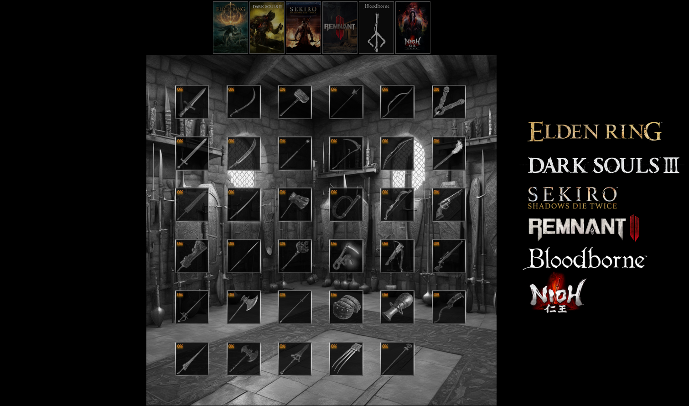

# Souls like weapons master

## Introduction
For this project, we arbitrarily selected six games categorized as souls-likes. Four of them are set in a universe similar to the Middle Ages, one in an era resembling the Victorian period, and the last one in an apocalyptic future including a journey through a multiverse bringing back to other eras of other worlds.

These games are:

- Elden Ring
- Dark Souls III
- Sekiro
- Nioh
- Bloodborne
- Remnant II

## The Idea

Our objective is to produce a visualization of the frequency of each weapon type in different souls-likes. This allows us to observe which games have the most weapons in X or Y categories compared to other games. To help navigate, the visualization also allows you to select a weapon to see the reference of all the games that make it available to players. Descriptions of each weapon are also available by hovering over them with a cursor.

## Testing Our Project
Your first step is to clone our git. Once done, you launch the project in your browser, using, for example, the "Go Live" feature of the Visual Studio Code editor. 
Then, follow the instructions on the page to start interacting with our visualization.

## Second Part
Following our interactive visualization, we offer you three other visualizations, allowing us to provide an analysis of the results of our research on weapons in these categories of souls-likes.

## Copyright
All images are from the Fandoms and the Steam pages of the respective games.

We used the [d3.js](https://d3js.org/) library for the second part.

## Creators
This project was created by:
- Olivier Oppliger
- Sébastien Franzone

Under the supervision of Isaac Pante during the "Data Visualization" course (SLI, Letters, Unil).
